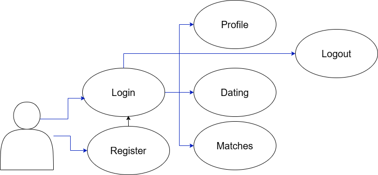

# Project Report

**Project Title:** TinderfyTM
**Team Number:** 12-6

## Team Members
- Amit Wieder (awieder) - wiederamit@gmail.com
- Sree Harsha Kalavagunta (Harsha-Kal) - sreeharshakalavagunta@gmail.com
- Nithin Manoj (Nithin-Manoj) - nithinmanoj2006@gmail.com
- Riley Polchin (rileyPo) - rileypolchin@gmail.com
- Max Jambor (maxjambor) - maxcjambor@gmail.com

## Project Description
TinderfyTM is a music-based dating application designed to match users based on the calculated similarity of their liked songs. Unlike traditional dating apps that rely primarily on visual preferences, Tinderfy emphasizes music taste as a key indicator of compatibility. Users select their favorite songs and complete their profiles. The application then processes these song choices to recommend users with similar musical interests, displaying a similarity score to aid in the decision-making process. If two users express interest in each other, a match is formed. Our target audience includes college students and adults who value music in their relationships. The application aims to provide an intuitive and accessible user experience, fostering connections through shared musical passions.

## Project Tracker
[Link to Project Tracker]

## Video Demo
[Link to 5-minute Video Demo]

## VCS Repository
[Link to GitHub Repository]

## Individual Contributions
- **Amit Wieder:** [Contribution details]
- **Sree Harsha Kalavagunta:** [Contribution details]
- **Nithin Manoj:** [Contribution details]
- **Riley Polchin:** [Contribution details]
- **Max Jambor:** [Contribution details]

## Use Case Diagram

## Wireframes

*(Note: PDF embedding might not work in all markdown viewers. Please refer to the attached WireFrame.pdf)*

## Test Results
See `MilestoneSubmissions/UAT_Plan.md` for the detailed test plan.
**Summary of Results:**
- Total Test Cases: 11
- Positive Test Cases: 6
- Negative Test Cases: 5
- Passed: [Number]
- Failed: [Number]

## Deployment
**Deployment Link:** [Link to Deployed Application]
**Description:** The application is deployed on [Platform, e.g., Render] using Docker containers.
